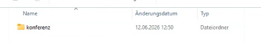
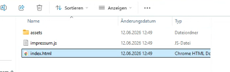
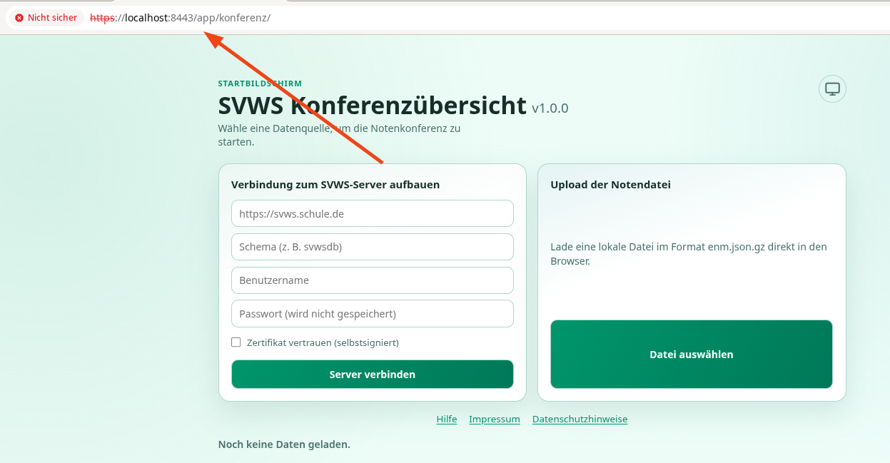
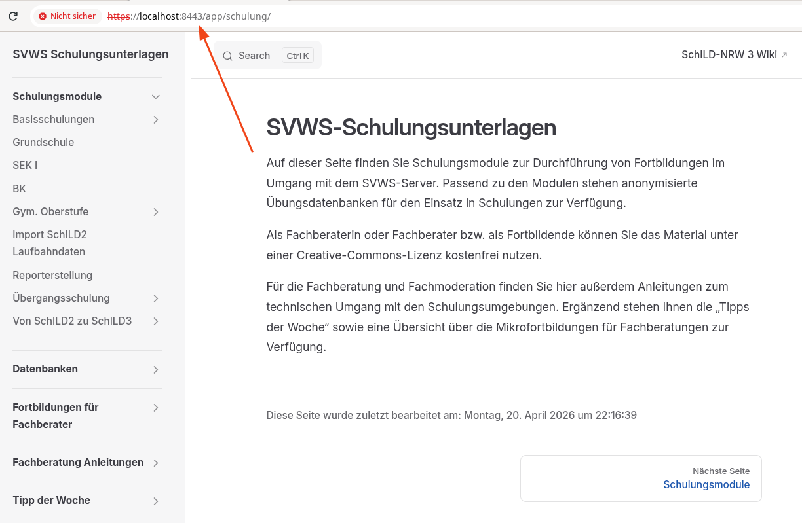
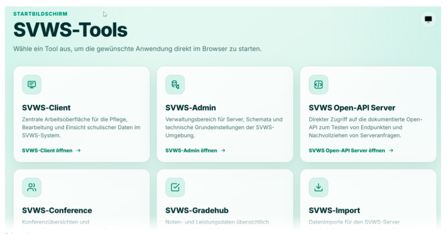

# SVWS-Tools

Unter den SVWS-Server können SVWS-Tools eingebunden werden, die insbesondere bei einfachen Tools direkt ein Einbinden unter dem Werbserver im SVWS-Server eingebunden werden.

## svwsconfig.json anpassen

Die Einstellungen in der Datei svwsconfig.json ist ausführlich unter [Einrichtung](../Einrichtung/index.md) beschrieben. 

Geben Sie zum Einbinden der SVWS-Tools im Eintrag `"AppsPath"` den entsprechenden Pfad an. Hier ein Beispiel:

```json
"Apps/Path": "/opt/app/svws/apps/"
```

## SVWS-Tools Einrichten

### Beispiel: SVWS-Konferenz

Legen Sie den Ordner 'konferenz' unter dem im Beispiel angegebenen Verzeichnis `/opt/app/svws/apps/` an: 



Download des Pakets [SVWS-Konferenz](https://svws.nrw.de/svws-tools/svws-konferenz) und den Inhalt entpacken in den Ordner, so dass direkt auf die index.html zugegriffen werden kann:



### Neustart und Test

Starten Sie den SVWS-Server neu:  `systemctl restart svws` unter Linux

Rufen Sie die folgende URL zum testen auf bei einem SVWS-Server, der unter Port 8443 läuft: 

```bash
https://Mein_SVWS-Server:8443/app/konferenz
```



## Fehlerquellen

### Schreibfehler

Achten Sie bitte auf das den Ausruf des Browsers auf `http://.../app/...`, also ohne "s", im Gegensatz dazu ist in der svwsconfig.json die Variable als `"Apps-Path"`. Das ist orthographisch richtig, birgt aber die Möglichkeit Menschlicher Fehleingaben.

### Ordnerstruktur

Unterhalb des `"Apps-Path"` erwartet der SVWS-Server für jede App genau ein namengebendes Verzeichnis in dem die Datei `index.html` aufgerufen wird. 

### Restart

 Der SVWS-Server muss einerseits nach dem editieren des svwsjson.config und andererseits auch nach jedem Anlegen eines neuen Tools neu gestartet werden, da auc die Ordnerstruktur unter dem AppsPath nur beim Start eingelesen wird. 


## Weitere Beispiele

Diese Technik bietet weiteren, einfachen html/typeScript basierten Projekten die Möglichkeit in die bestehende Infrastrukur des SVWS-Servers integriert zu werden. Hier einige Beispiele: 

### lokale Schulungsunterlagen



Am Beispiel der Schulungsunterlagen kann das grundsätzliche Vorgehen nachvollzogen werden und z.B. auch für die für die lokale Einbindung des SVWS-Dokumentation oder ähnlicher Vite-Press Projekte herangezogen werden.

```bash 
git clone https://github.com/SVWS-NRW/Schulungsunterlagen
cd Schulunggsunterlagen 
npm i 
```

In der Datei `.vitepress/config.ts` den Pfad anpassen: Wenn der Aufruf in der URL `httpsd://Mein_SVWS-Server/app/schulung `  sein soll, so muss der Pfad entsprechend verändert werden: 

`base: env.BASE === undefined ? '/Schulungsunterlagen/' : env.BASE,`  
`base: env.BASE === undefined ? '/app/schulung/' : env.BASE,` 

Nun kann der html Code erzeugt und in das entsprechnde Verzeichnis verschoben werden. 

```bash 
npm run build
cp -r /Where/Ever/Schulungsunterlagen/.vitepress/dist/* /SVWS_Server_APPPath/schulung/
systemctl restart svws
```

## All in one Server


Für die Einbindung bzw. Nutzung im **SVWS-Server** stehen mittlerweile zahlreiche Tools zur Verfügung. Die Liste wächst kontinuierlich und wird fortlaufend erweitert.

Eine aktuelle Übersicht der bisher geeigneten Tools:


* **SVWS-Konferenz**
* **SVWS-Prognos**
* **SVWS-WebLupo**
* **SVWS-GradeHub**
* **SVWS-Import**
* **SVWS-Dokumentation**
* **SVWS-Schulungsunterlagen**
* **SVWS-Media**
* ...

Die Aufzählung erhebt keinen Anspruch auf Vollständigkeit. Weiterhin kann auch eine Startseite kreiert werden, die alle enthaltenen Tools und z.B. den Client des SVWS-Servers zusätzlich verlinken. Ebenso externe Quellen, wie den SVWS-WeNoM können verlinkt werden. Hier eine Anregung zu den noch möglichen Verlinkungen: 

* **SVWS-Client**
* **SVWS-Adminclient**
* **SVWS-SwaggerUI**
* **SVWS-WeNoM**

Ein möglich Ansicht einer Startseite: 



### Installationsbeispiele

Installationsbeispiele als Skript oder in einer fixen Version, die mit SVWS-1.4.1 kompatibel ist finden Sie unter den [SVWS-Schulungsunterlagen}(https://svws-nrw.github.io/Schulungsunterlagen/) im Bereich Fachberatung_Anleitungen. 